```{r load_packages, message=FALSE, warning=FALSE, include=FALSE} 
# devtools::install_github("rstudio/fontawesome")
# remotes::install_github("gadenbuie/xaringanExtra")
# remotes::install_github("gadenbuie/countdown")

library(fontawesome)
library(xaringanthemer)
library(countdown)
xaringanExtra::use_panelset()

options(htmltools.dir.version = FALSE)

style_mono_accent(
  base_color = "#272822",
  header_font_google = google_font("Roboto"),
  text_font_google   = google_font("Roboto", "300", "300i"),
  code_font_google   = google_font("Fira Mono")
)
```

class: middle

Die folgenden Themen kommen alle mit dem `shinythemes` package:

```{r, eval = FALSE}
# install.packages("shinythemes")
library(shinythemes)
```


---

class:center, middle, inverse

## Verschiedene "Themes" für Eure Shiny-App

---

##  `cerulean`


---

##  `cosmo`


---

## `cyborg`

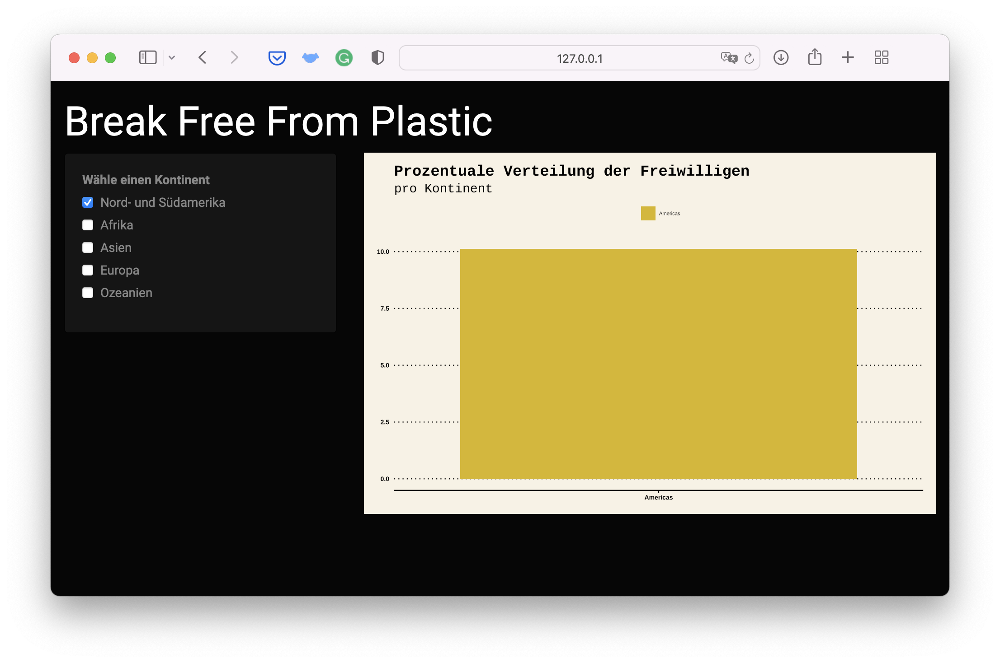


---

##  `darkly`

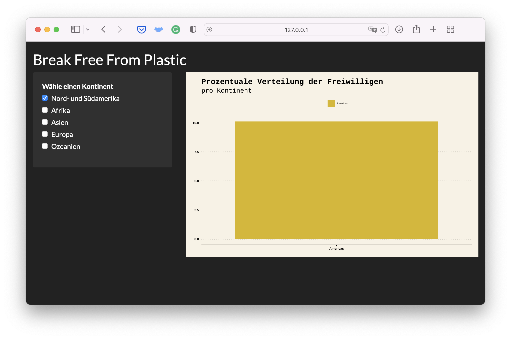

---

##  `flatly`

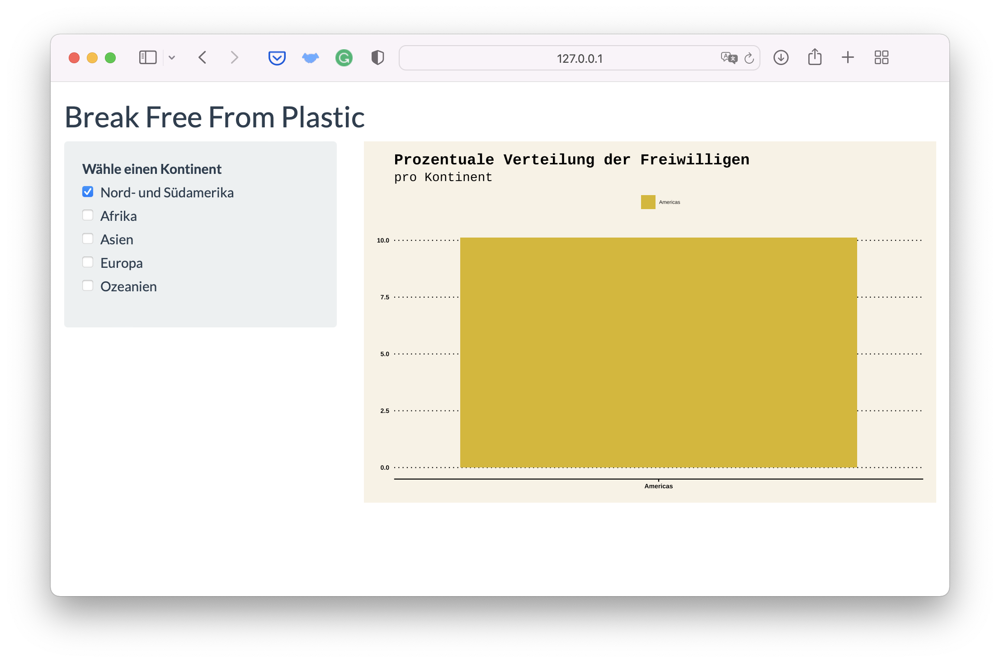

---

##  `journal`

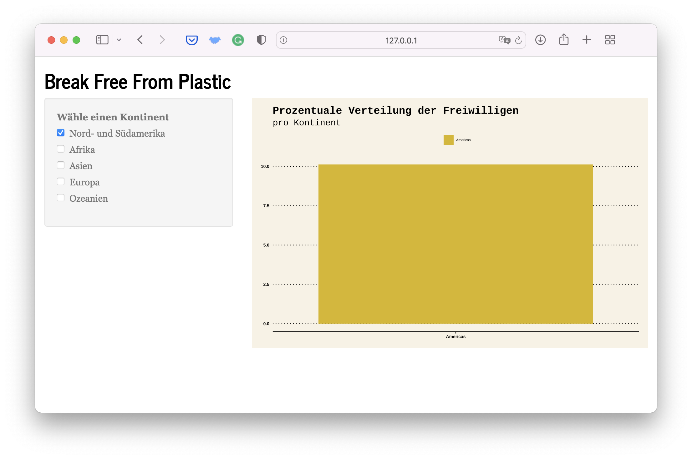


---

##  `lumen`

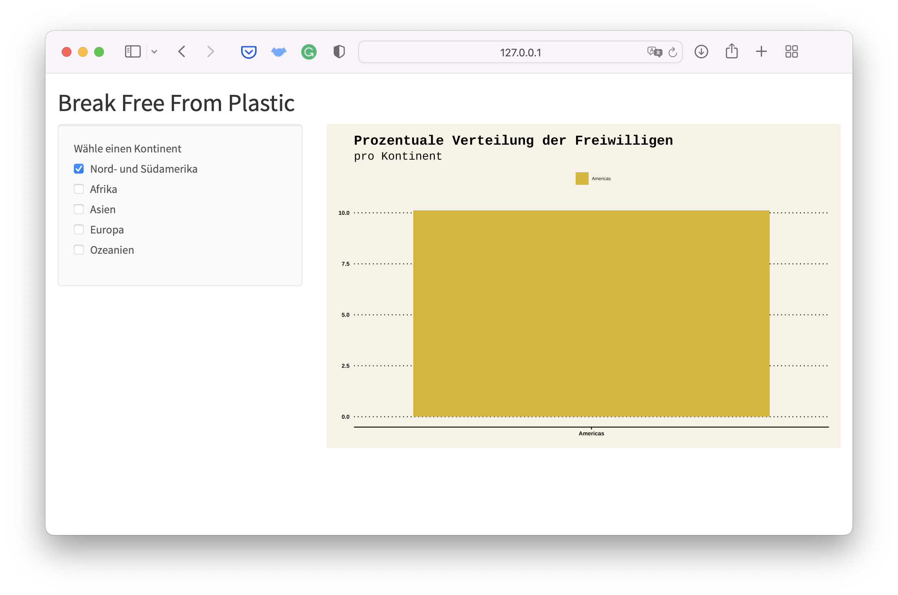


---

## `paper`

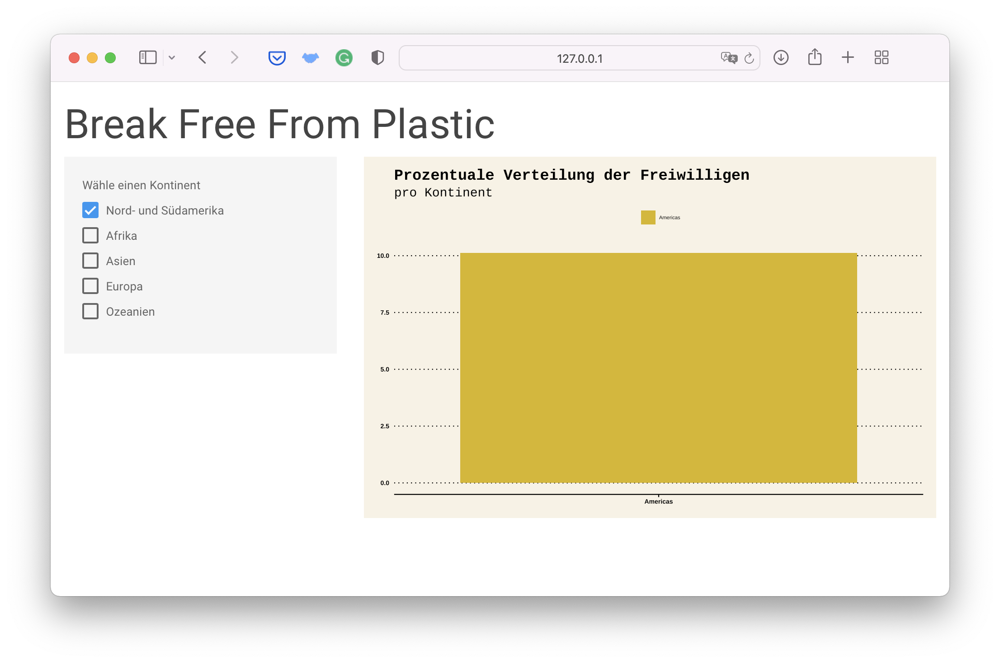


---

##  `readable`

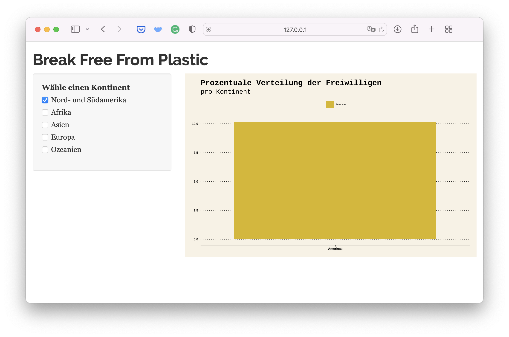


---

##  `sandstone`

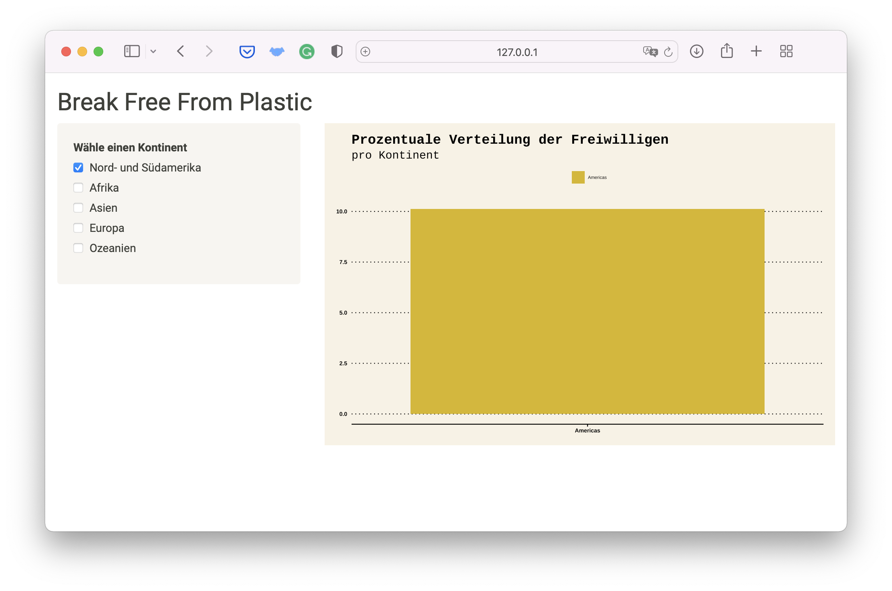

---

##  `simplex`

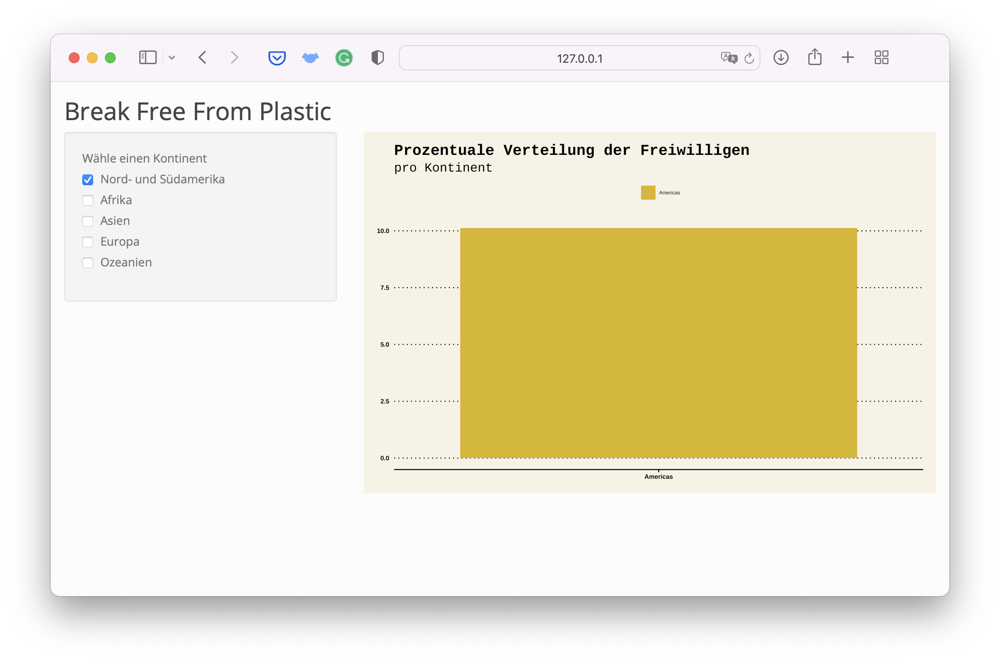

---

## `slate`

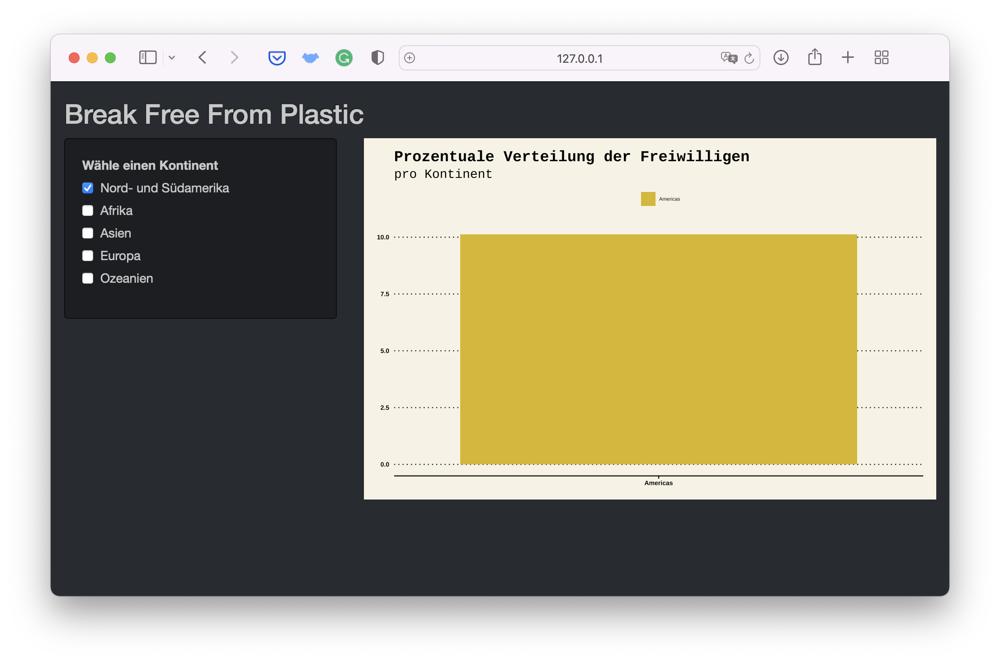

---

##  `spacelab`


---

##  `superhero`

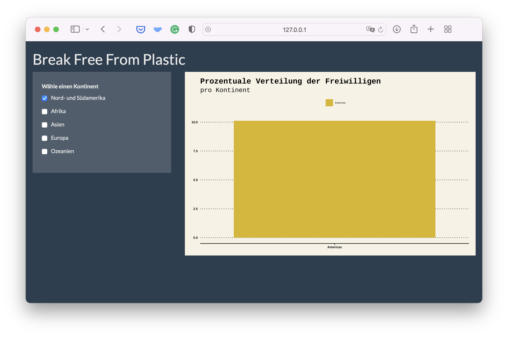
